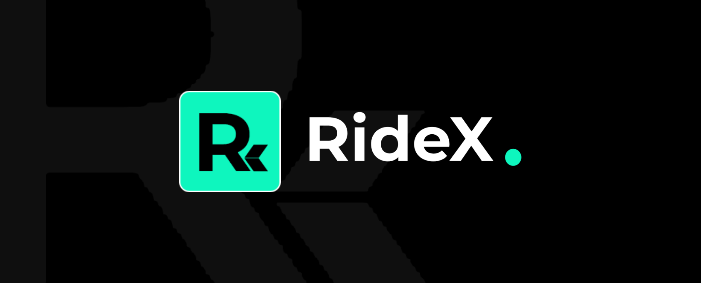
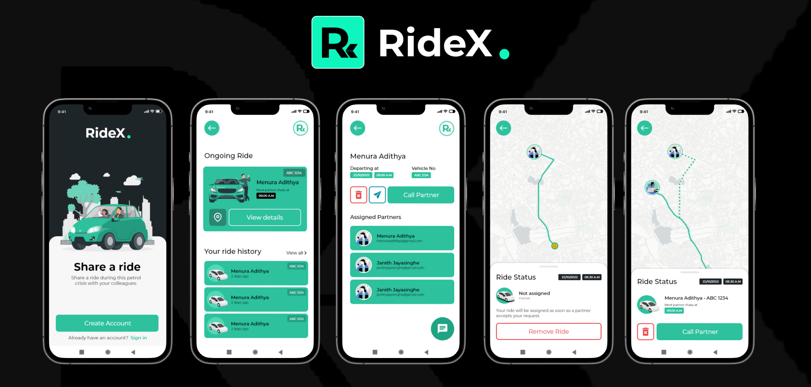

# RideX

## Table of Contents

- [Introduction](#introduction)
- [Features](#features)
- [Build Process](#build-process)
- [Tech Stack](#tech-stack)

 

## Introduction

RideX is an ridesharing app that provides facilities to university of Sri Jayewardenepura staff during the fuel crysis. Since this is an ongoing project the backend and the frontend of the applications are not finished yet.

## Features

🚀 Single App (Rider & Client Usage)  
🚀 Add a ride request  
🚀 Assign clients to a ride  
🚀 Free maps using leaflet maps  
🚀 Free routing using Open Source Routing Machine (Public API)

## Build Process

- Clone or download the repo
- `npm install` or `yarn` to install dependencies
- `npm start` or `yarn run dev` to run the server application

## Tech Stack

    
    
    

